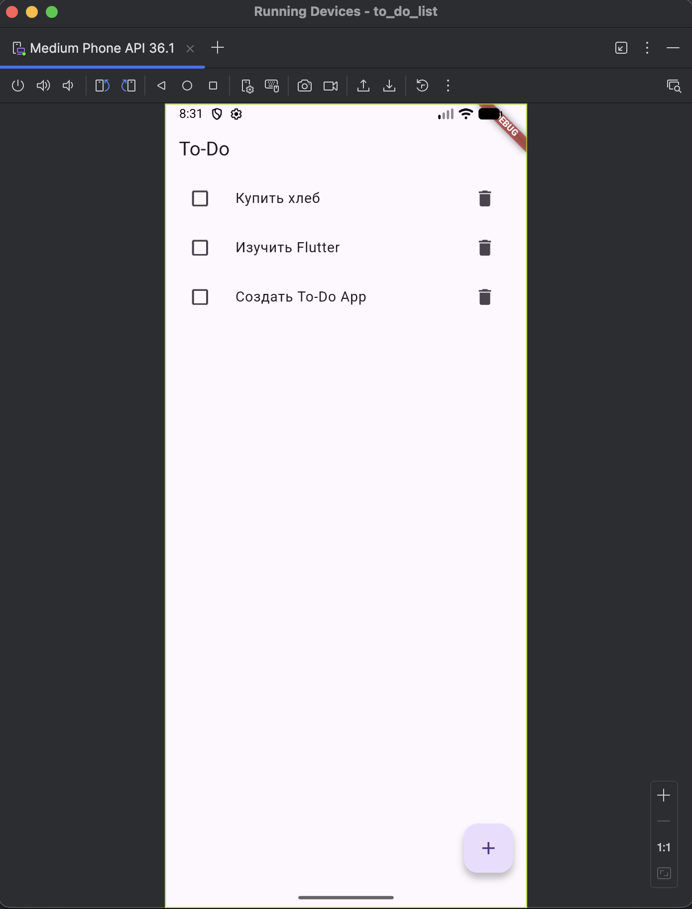
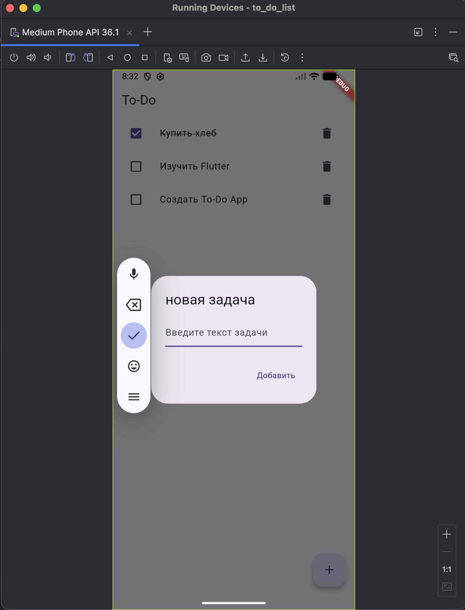

# Read me T-DL

Приложение T-DL (To-Do List) предназначено для создание и удаление заметок. Пользователь может добавлять, удалять, помечать задачи как выполненные и создавать списки задач. На 1 (и единственном) экране пользователь увидит окно для ввода заданий, под ним список задач и окошки для отметки. Выполненные задачи будут перечеркиваться и становиться серыми. 
Список задач будет выглядеть как таблица (номер, содержание, выполнина ли). Данные id - содержат в себе номер задачи. Данные title - содержат название/ тресц задачи. Данные isDone - показывают выполнена ли задача.

## Возможности
- Просмотр списка задач
- Добавление новой задачи
- Отметка задачи как выполненной
- Удаление задачи

## Скриншоты




## Запуск проекта
```bash
flutter pub get
flutter run
